# Informe académico (entrega 1)

## Repositorio Git
- Git es un proyecto de código abierto y seguro, en el que podremos almacenar nuestros códigos, archivos e historial de cambios durante la duración del proyecto (y posterior también). 
- Git además permite trabajar con diversas personas de forma pública o privada permitiendo trabajar dentro del mismo repositorio o creando copias de la misma para que cada operador pueda trabajar individualmente sin la necesidad de estar en grupo a la hora de realizar los cambios .

### Repositorios locales y remotos 
- **Los repositorios locales** nos permiten a los desarrolladores, realizar una copia del repositorio que está ubicado en Git a nuestros dispositivos, en lo que cada uno tendrán los datos actualizados hasta la fecha de retirados, en este mismo podrán trabajar de forma individual y subir los cambios realizados al Repositorio Git, para eso cumple con ciertas funciones para que no haya incompatibilidad y que nuestro Repositorio quede inutilizable. Por ejemplo antes de subirlo podremos traer los datos que hay en el **Repositorio Git** a nuestro **Repositorio Local** y validar que no haya ningún inconveniente ni conflictos.

- Por otro lado, un **repositorio remoto** es lo que sería una copia de seguridad en la nube. Es una forma de ubicar nuestros archivos en internet, permitiéndonos acceder a él desde cualquier dispositivo siempre y cuando contemos con conexión a internet.

### Aplicación de Git

- En cuanto a los comandos utilizados en Git una vez gestionada la creación del repositorio local en cada dispositivo fueron:
- **git add .** (Para agregar todos los archivos modificados al staging area).
- **git commit -m "---------"** (Preparar para subir todo los archivos del staging area).
- **git branch** (Seguido del nombre de la rama que queramos crear).
- **git checkout** (Lo utilizamos para movernos entre las ramas creadas).
- **git merge** (Para fusionar los cambios realizados por una rama a la rama en la que estemos parados, esto se hace indicando el nombre de la rama luego de colocar “git merge”).
- **git push** (Aquí se lleva todos los cambios “commiteados” al repositorio remoto, nosotros utilizamos la URL del repositorio para ubicar al mismo).
- **git pull** (Con este comando nos traeremos todos los datos modificados en el repositorio remoto, por ejemplo cambios que otro usuario agregó).

##  Versionado
### Buenas prácticas de versionado
Aquí colocaremos algunas de las buenas prácticas utilizadas para el versionado.
- Creación de ramas específicas para cada proceso.
- No realizar commits en la rama “main” u “origin”.
- Commits con descripciones sobre los cambios realizados.
### Evolución del proyecto

## Elicitación
### Actividades de investigación

- Para el proyecto en cuestión necesitaríamos encontrar a quien sería nuestro usuario ideal (User Persona) pero para el mismo tendríamos que aplicar distintas actividades de Elicitación siendo:

#### Tormenta de ideas: 
- Con este método podremos obtener un vistazo general del proyecto y aclarar algunas dudas entre nosotros, generando así posibles funciones para implementar en este proceso del proyecto.

#### Observación:
- Con este método podremos observar el funcionamiento de aplicaciones similares a nuestro enfoque de proyecto para tener una idea concisa y estructurada de lo que podemos y no implementar en nuestro proyecto.

#### Entrevista con Usuarios potenciales 

- En este hablamos con dueños de mascotas para lograr comprender sus necesidades, preocupaciones y expectativas a la hora de adoptar en línea para lograr encontrar la mejor opción para cada caso dado y facilidades para realizar la adopción.

#### Encuesta  

- Una vez ya realizado entrevistas para saber cuales son las expectativas y necesidades del cliente, tendríamos lo que sería una idea general de lo que podría ser necesario a razón de los clientes en general, para reforzar eso implementaremos una encuesta. 
- Esta encuesta nos permitiría visualizar las preferencias y comportamientos de los usuarios a la hora de manejar un servicio en línea como lo sería nuestro proyecto.

#### Stakeholders

- **Adoptantes** (Este sería nuestro cliente ideal y el foco de nuestro proyecto):Alto poder e interés.
- **Veterinarios:** Poder medio pero interés alto .
- **Refugios:** Poder e interés moderado.
- **Individuos que quieran dar en adopción:** Bajo poder e interés .
- **Perreras:** Poder e interés moderado.
- **Medios de información:** Alto poder pero bajo interés.
- **Estado:** Alto poder e interés.
- **Comunidad local alrededor de las zonas de adopción:** Alto interés pero bajo poder.
- **Participantes del proyecto:** Alto poder e interés.
- **Inversores:** Alto poder e interés.

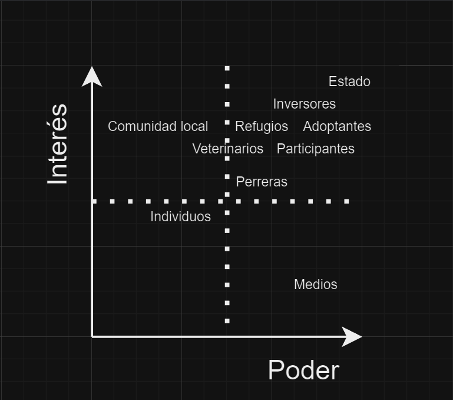

#### Potencial Cliente 
- Como se mencionó anteriormente al dar visibilidad a los stakeholders,nuestros clientes son aquellos individuos que desean compartir su hogar y vida con una mascota(Adoptantes), buscando una experiencia de adopción responsable que se adapte a su estilo de vida y al espacio disponible en su hogar. Estas personas están interesadas en tener una o varias mascotas para disfrutar de su compañía, brindándoles un ambiente amoroso y cuidadoso que satisfaga las necesidades tanto del animal como de la familia.
- A su vez tambien hay que tener en cuenta los usuarios que darán en adopción a las mascotas en cuestión ya que tambien serán gran parte de nuestros clientes, en este caso se visualizan tambien en los stakeholders y son los anteriormente mencionados Refugios, Perreras, Veterinarias e individuos que desean dar en adopción por diferentes razones.

#### Posibles preguntas para una entrevista a personas con mascotas.
- ¿Qué te llevó a decidir adoptar una mascota?
- ¿Cuántas mascotas tienes?
- **En caso de que diga solo una**
- ¿Cómo es la relación de tu mascota con respecto a tu entorno (amigos, familia u otras mascotas)?
- ¿Cómo le dedicas tiempo a tu mascota cuando estás con ella?
- ¿Qué medios usas para mantener entretenida a tu mascota?
- **En caso de que diga más de una:**
- ¿Cómo es la convivencia entre tus mascotas?
- ¿Se llevan bien entre ellas?
- **En caso de que diga que sí pero antes no**
- ¿Qué estrategias utilizaste para ayudar a que tus mascotas se lleven bien entre ellas?
- **Siguiente preguntas para cualquier caso**
- ¿Tus mascotas están vacunadas?
- **En caso de que diga que no:**
- ¿Hay alguna razón en específica por la cual decidiste no vacunar a tus mascotas?
- ** Menciona cualquier opción ajena a falta de recursos**
- ¿Conoces los riesgos asociados con no vacunar a tus mascotas?
- **Siguiendo con la entrevista para el caso de que diga que no**
- ¿Qué medidas tomas para proteger la salud de tus mascotas en ausencia de vacunas?
- **En caso de que diga si vacuna a sus mascotas**
- ¿Los llevas muy seguido al veterinario?
- **En caso de que diga que si**
- ¿Cómo manejas las visitas al veterinario y el seguimiento de las vacunas y cuidados médicos de tus mascotas?
- ¿Tus mascotas están acostumbradas a ir al veterinario?
- **Hablando respecto al espacio de su hogar**
- ¿Tu casa cuenta con espacio verde?
- **En caso de que diga que si**
- ¿Es lo suficientemente grande como para que tu mascota pueda jugar y agotar sus energías?
- **En caso de que diga que no o que hubiera dicho que no en la pregunta anterior a esta**
- ¿Sueles sacar a pasear a tus mascotas?
- **En caso de que diga que si**
- ¿Lo haces seguido?
- **En caso de que diga que no**
- ¿Por algún motivo en particular?

#### ENTREVISTA
Aqui aplicamos la entrevista con seus respectivas preguntas y respuestas.En este caso entrevistamos a Matilde, estudiante de biotecnologia en la ORT.

**Buenas, primero que nada muchas gracias por aceptar la entrevista y tomarte un tiempo para responderla.**

- Sisi no hay problema.

**Primero presentate**

- Hola, soy Matilde y estudio ingeniería en biotecnología.
 
**¿Bueno qué te llevó a decir a adoptar una mascota?**
- Bueno, mi familia que viene del interior, tuvo cachorros y como los tuvieron, entonces decidimos adoptar mascota o sea ya que en ese momento no teníamos, pero durante toda la vida y es costumbre a mi familia tener mascotas.
 
**¿Cuántas mascotas tienes en la actualidad?**
- Tengo una mascota, un perro, que se llama Milo.
 
**¿Cómo es la relación con la mascota respecto a tu entorno, amigos, familia u otras mascotas?**
- Bueno milo es muy tranquilo con la gente ya sea si vienen amigos o familia o gente que no conoce el igual cuando llegan siempre se tira al piso y espera que le hagan mimos o sea que no es un problema ni hay que cuidar a los niños alrededor de él, sí suele ladrar a otros perros cuando le sacamos a pasear, pero con la gente nunca.
 
**¿Cómo le dedicas tiempo a tu mascota cuando estás con ella?**
- Bueno, normalmente me tiró al pasto y terminamos jugando o le tiró la pelota para que la vaya a buscar o salimos a caminar.
 
**¿Qué métodos usas para mantener entretenida a tu mascota?**
- Normalmente se entretiene solo siempre hay pájaros en el fondo de casa y terminó jugando con ellos o también con los gatos de los vecinos ahí le ponemos pelotas en el fondo, pero no es que necesite mucho entretenimiento del que ya dispone.
 
**¿Tus mascotas están vacunadas?**
- Sí, normalmente tenemos una veterinaria que se encarga de todas las vacunas entonces ellos lo tienen al día.
 
**¿Lo llevan muy seguido el veterinario?**
- Normalmente no lo llevo si no le pasa nada realmente le pasó si le pides si veo que se empieza a rascar mucho o que tiene algo raro en la piel, pero no es una cosa que lo llevó todos los meses.

**¿Cómo maneja las visitas al veterinario y el seguimiento de las vacunas y cuidados médicos de tu mascota?**
- Bueno él en general es bastante tranquilo si solo hay gente o sea si son las personas que están atendiendo y no hay ninguna otra mascota lo maneja bastante bien está tranquilo, pero si llegan a entrar otras mascotas suele ser un problema.
 
**¿Dirías que tu mascota está acostumbrada a ir al veterinario?**
- Sí está acostumbrada porque ha tenido varias visitas sobre todo creo que lo más complicado son las visitas iniciales de vacunas, pero después cuando están revisando no hay ningún problema
 
**¿Tu hogar cuenta con un espacio verde?**
- Sí tenemos un fondo que le da amplio espacio para correr todo lo que quiera
 
**¿Sueles sacar a pasear a tus mascotas?**
- De vez en cuando, la verdad que tiene mucha más fuerza que yo entonces normalmente lo mandó mi hermano para que lo saque a pasear
 
**¿Y cuándo lo sacan a pasear?**
- Capaz que una vez a la semana, lo que me pasa que realmente o sea el en el fondo tiene bastante espacio entonces no es que es un perro que está encerrado todo el tiempo en un apartamento y necesita que lo saquen a pasear todos los días siempre está corriendo.

**Si hubiera una aplicación para la web para adoptar mascotas, ¿qué cosas te serían interesantes para tener?**
- Me gustaría ver una gran variedad de mascotas con lo que sería su historia, digo para que puedas conocer cosas como su personalidad y necesidades, que puedas sentir una conexión no solo por las fotos sino por como es y lo que vivió.

**¿Qué incentivos te ayudarán a usar una aplicación para adoptar mascotas?**
- Creo yo que el poder hablar con personas que capaz tienen los mismos inconvenientes que vos, no se, por ejemplo que tu perro no te haga caso cuando lo llamas, capaz no es un ejemplo bueno pero, que alguien te de tips para poder solucionar esos problemas, no se si me expliqué.

**¿O sea que te gustaría que la aplicación te facilitará la comunicación con Veterinarios por ejemplo?**
- Estaría bueno si, antes me refería a lo que sería un foro o algo parecido, pero poder comunicarte con Veterinarios, entiendo que para adoptar al animal que están dando en adopción ¿no?

**Si, digamos que una vez queres dar en adopción te pones en contacto con el perfil que lo da en adopción en si**
- Ah, bien entiendo, me parece perfecto, más que nada para tener un seguimiento, o sea que tengas al veterinario o quien lo de en adopción para resolverte dudas de la mascota y en caso de que ya lo adoptes que te pregunte cómo está. 

**¿Qué medidas de seguridad esperarías que implemente la aplicación para garantizar la seguridad de la mascota adoptada?**
- A lo que iba anteriormente, que tengas al Veterinario atrás digamos, que tienes que mostrarle pruebas de que está bien, capaz no tan riguroso como que tengas que mandarle fotos toda la semana, pero si que tengas una forma de enviarles pruebas de que el animal está bien cuidado. 

**¿Te gustaría que la aplicación proporcione recursos adicionales, como consejos de cuidado de mascotas, servicios de entrenamiento o asistencia veterinaria en línea?**
- Estaría bueno que dependiendo del animal tenga un apartado de las recomendaciones para el cuidado de la nueva mascota,  entrenamiento y asistencia veterinaria en línea.

**¿Qué información consideras crucial que esté disponible en los perfiles de las mascotas para tomar una decisión informada de adopción?**
- Como dije anteriormente yo creo que estaría bueno que tenga la historia del animal, capaz que un espacio para mostrar la salud del animal, si tiene las vacunas al día por ejemplo, si tiene alguna enfermedad, cual y capaz información sobre la misma. No sé, al final de todo estamos hablando de una vida que necesita de cuidados como todo ser vivo.

#### Adjuntamos prueba de la entrevista:

#### Adjuntamos graficas de la encuesta (50 participantes):
- 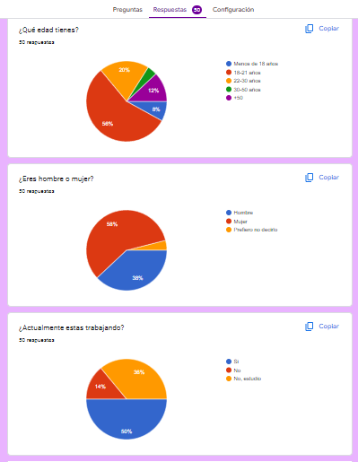
- 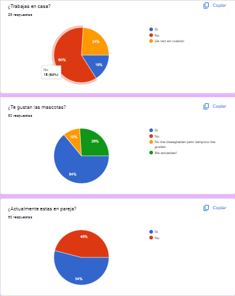
- 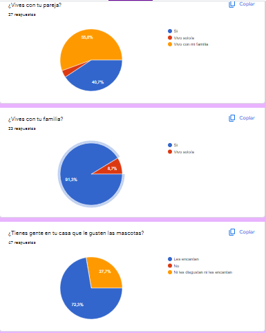
- 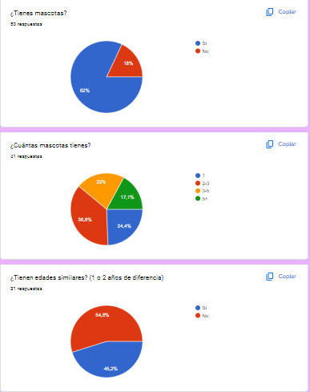
- 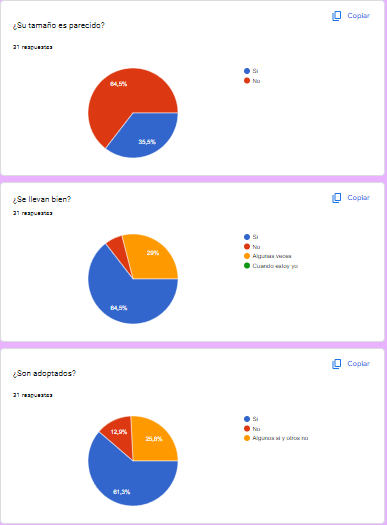
- 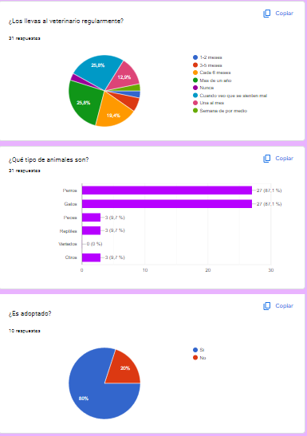
- 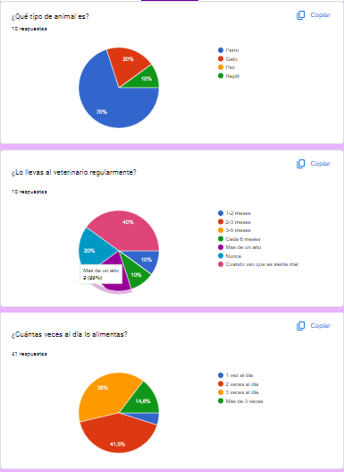
- 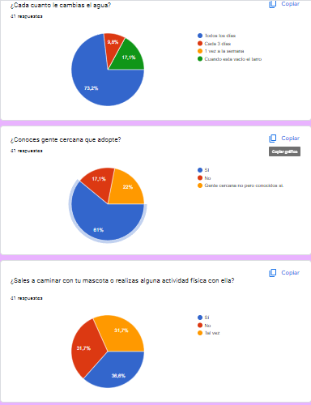
- 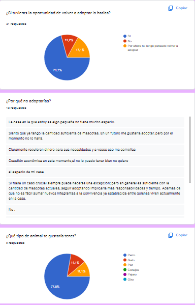
- 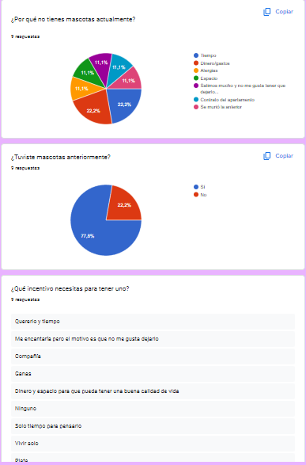
- 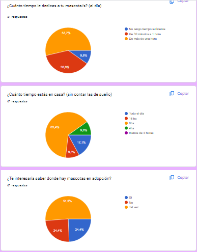
- 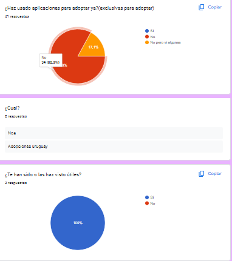
- 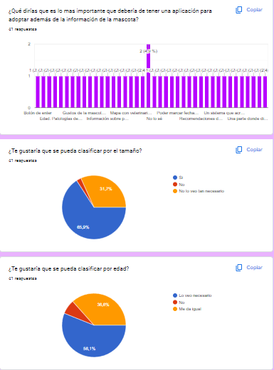
- 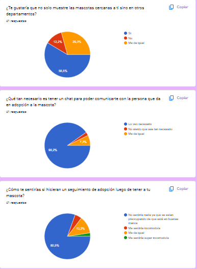
- 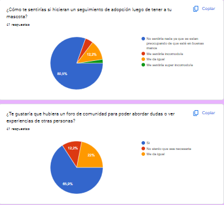

### Caracterización de usuarios
## User Persona:
- Teniendo en cuenta la información recaudada mediante la encuesta realizada se visualiza que la gran mayoría de personas que aplicaron a la encuesta son personas de entre 18 a 21 años y en su gran mayoría mujeres, nos basaremos en esto para crear un User Persona que se adapte a nuestro usuario ideal.
Para eso no solo nos basaremos en estos datos sino en los siguientes brindados por la misma encuesta como datos sobre la preocupación por sus mascotas (ya que la mayoría de personas que realizaron la encuesta tienen más de 1 mascota en su casa), los cuidados que le brinda y su decisión de adoptar antes que comprar. Con lo obtenido anteriormente realizamos este concepto de usuario:

- En este caso a su vez tomamos en cuenta la parte que dará en adopción, dando como pie a otro concepto de usuario:

**En este usuer persona dimos como ejemplo una persona que ejerce como veterinaria pero tambien contemplamos la posibilidad de que quien de en adopción sea una persona sin conocimientos sobre mascotas (un individuo que quiera dar en adopción), voluntarios que deseen llegar a mas medios para dar en adopción (refugios) u otras entidades (perreras).**

### Modelo conceptual del problema

#### Diagrama de las funcionalidades de la aplicación.

## Especificación

### Requerimientos funcionales y no funcionales
- Para encontrar los requerimentos funcionales y no funcionales de nuestra aplicación nos basamos principalmente en tres cosas:
     - La primera fue una puesta en común entre los integrantes del grupo, dando ideas para poder encaminar nuestro proyecto.
     - La segunda fue basarnos en feedbacks recibidos mediante algunos comentarios de algunas preguntas de la encuesta realizada.
     - La tercera fue observar el funcionamiento de una aplicación similar a lo que sería nuestro proyecto, la aplicación se llama KatDog desarrollada por METALABS de la cual se encuentra por ejemplo en la AppStore de los dispositivos IOS. https://apps.apple.com/uy/app/katdog/id1580306314?l=es-MX
     Imagenes de ejemplo de la aplicación:
    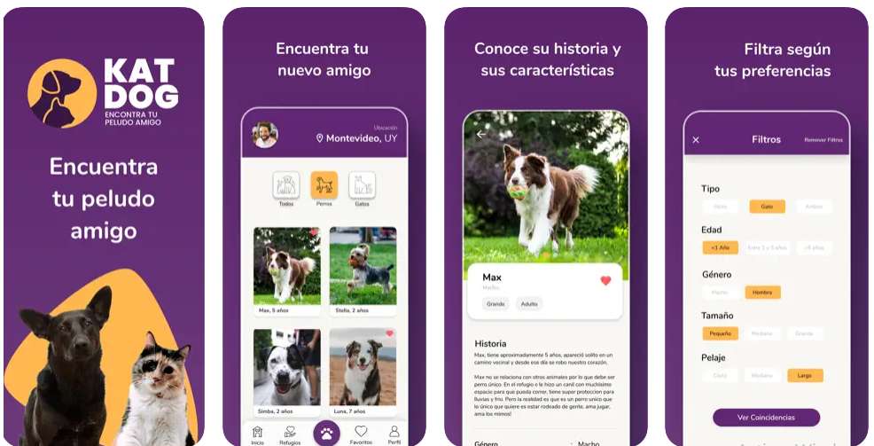
#### Requerimentos Funcionales:
- **Registro de Usuarios**: Pese a que en el proyecto no contemplamos el registro de usuarios en este caso, dejamos en claro con esta oración que contemplamos que los usuarios podrán ingresar como adoptante o como persona/organización que da en adopción (Veterinaria,Perrera,Refugio o individuo).

- **RF 1: Filtro de opciones (Prioridad Alta)**: Ofrecer funciones de búsqueda que permitan a los usuarios filtrar las mascotas disponibles según criterios específicos como el tipo de mascota, raza dependiendo de la mascota, edad, tamaño, temperamento, y compatibilidad con otras mascotas en el hogar.

- **RF 2: Conexión con Refugios, Perreras, Veterinarias(Prioridad alta)**: Integrar a la aplicación la posibilidad que se puedan registrar refugios de animales, perreras y veterinarias para mostrar mascotas disponibles y facilitar el proceso de adopción.

- **RF 3: Visualización de Perfiles de Mascotas(Prioridad alta)**: Mostrar perfiles detallados de cada mascota disponible para adopción, incluyendo fotos, descripción de su personalidad, historia, ubicación de la mascota, requisitos de cuidado (enfermedades, condiciones especiales, alergias, etc.) y si tiene condiciones para ser adoptado, como por ejemplo que solo puedas adoptarla si ya tienes otra mascota en tu casa.

- **RF 4: Adopción Directa(Prioridad alta)**: Permitir al usuario solicitar la adopción de una mascota directamente a través de la aplicación en el que el adoptante pueda comunicarse con el perfil que este dando en adopción a la mascota para asi, si cumple con los requisitos solicitados por la entidad que da en adopción, proseguir con la misma.

- **RF 5: Seguimiento Post-Adopción(Prioridad media)**: Proporcionar una función para que los adoptantes actualicen el estado de la mascota después de la adopción, permitiendo a los usuarios compartir fotos y actualizaciones sobre su nueva mascota, en caso de que no se brinde ninguna información, el perfil que haya puesto en adopción a la mascota podrá contactarse con el adoptante para solicitar la información del estado del animal.

- **RF 6: Comunidad de Usuarios y Contactos(Prioridad media)**: Permitir a los usuarios interactuar entre sí a través de funciones como foros de discusión y la oportunidad de mantener contacto con los refugios, perreras u otros usuarios de la aplicación fomentando así una comunidad de amantes de los animales comprometidos con la adopción responsable.

#### Requerimento No Funcionales:
- **RNF 1: Usabilidad y Experiencia del Usuario**: 
La aplicación debe ser fácil de usar e intuituva, con una interfaz amigable que permita a los usuarios navegar sin problemas, que se sientan comodos, para eso ubicaremos de forma estrategica los botones y acciones del usuario para brindarle una sastisfacción de tener todas las opciones en la palma de su mano, haciendolo a su vez legible y entendible tanto como para jovenes y adultos.

- **RNF 2: Accesibilidad(Prioridad alta)**:
En base a la accesibilidad se deberá cumplir con los estandares de accesibilidad de WCAG 2.2 (Web Content Accessibility Guidelines) cuyas reglas las podremos visualizar en https://www.w3.org/WAI/standards-guidelines/wcag/new-in-22/.

- **RNF 3: Lenguaje(Prioridad alta)**:
La aplicación deberá ser realizada por el lenguaje de programación llamado **Java**, un lenguaje de etiquetas denominado **HTML** (HyperText Markup Language) y un lenguaje de estilos denominado **CSS** (Cascading Style Sheet).
 
- **RNF 4: Rendimiento y Escalabilidad (Prioridad media/alta)**: 
La aplicación debe ser capaz de manejar los datos y permitir a los usuarios concurrentes navegar por la aplicación sin problemas como lo sería responsividad de la aplicación dando una respuesta de 3 segundos como máximo.

- **RNF 4: Seguridad de los Datos (Prioridad alta)**: 
Garantizar la seguridad y privacidad de la información personal de los usuarios utilizando ciertos párametros de seguridad como lo son: 
- 1: Autentificación de dos pasos.
- 2: En caso de equivocarte tanto a la hora de ingresar tu nombre de usuario o tu contraseña mantener la incognita de que valor es invalido, ejemplo "Tu usuario y/o contraseña ingresada es incorrecta".
- 3: No brindar datos como mail o número de tel asociado a la cuenta del usuario a otros usuarios de la aplicación.

- **RNF 5: Localización (Prioridad media)**: 
Ofrecer opciones de localización para que el usuario ingrese su ubicación geográfica y le muestre las mascotas más cercanas a su ubicación.

- **RNF 6: Soporte Técnico (Prioridad alta)**: Se deberia brindar un soporte técnico eficiente y amigable para ayudar a los usuarios con cualquier problema técnico o consulta relacionada con la aplicación, en este caso incluiriamos tanto en la aplicación un chatbot para poder resolver dudas frecuentes que tengan los usuarios y un soporte técnico humano en caso de que sean cosas puntuales o necesarias de resolver con un operador.

- **RNF 7: Mantenimiento (Prioridad alta)**: 
Gestionar un mantenimiento constante, solucionando errores o simplemente mejorando la eficiencia o interfaz de la aplicación añadiendo parches cada semana con arreglos de **bugs** o mejoras visuales.

### User stories
#### User Storie 1:
- **Título:** Filtrar animales  
- **ID User Stories:** 1.
- **ID Use Cases Vinculados:** 1 y 2.
- **ID Bocetos UI Vinculados:** 4
- **Como:** Persona que adopta  
- **Quiero:** Poder filtrar los animales dependiendo de su tamaño,edad,cercanía a mi, etc.  
- **Para:** Poder encontrar la mascota que más se adapte a mis preferencias y situación del hogar como por ejemplo el espacio en el que vivirá mi futura mascota.  
- **Criterios de aceptación:**
- Se mostrará una lista de clasificaciones según el área seleccionada, por  Ejemplo: - Tamaño(chico, mediano, grande).
- Edad (Desde que edad y hasta que edad).
- Tipo (Perro,Gato, Variado).
- Radio de ubicación (Hasta que km se debe de extender la búsqueda de otros perfiles que den en adopción)
- Se mostrará una vez seleccionado el filtrado designado una lista de todas las mascotas que cumplan con los requisitos del filtrado

#### User Storie 2:
- **Título:** Chat de contacto
- **ID User Stories:** 2.
- **ID Use Cases Vinculados:** 3.
- **ID Bocetos UI Vinculados:** 2 y 6.
- **Como:** Persona que pone en adopción o adoptante
- **Quiero:** Poder facilitar la comunicación entre ambas partes y así concretar de manera más fácil la adopción.
- **Para:**  Poder encontrar un hogar para esas posibles mascotas en necesidad o poder adoptar sin la necesidad de realizar visitas al lugar de adopción de la mascota.
- **Criterios de aceptación:**
- Se mostrará un chat el cual contará con: foto del contacto, rating del contacto, etc.
- Se podrá enviar al contacto la publicación en cuestión a gestionar.
- Se podrá mandar fotos, documentos, etc para agilizar la gestión de adopción si se necesita algún dato o comprobante por parte del adoptante o del que da en adopción.

#### User Storie 3:
- **Título:** Ver información de la mascota a adoptar.
- **ID User Stories:** 2.
- **ID Use Cases Vinculados:** 3.
- **ID Bocetos UI Vinculados:** 3.
- **Como:** Persona que adopta.
- **Quiero:** Poder ver cosas de la mascota como datos médicos, fotos y videos.
- **Para:** Poder agregar datos a tener en cuenta para adaptarlo.
- **Criterios de aceptación:** 
- Se podrá ver la información más a detalle del animal en adopción.
- Se podrá conectar más el usuario con la mascota antes de decidir si aceptarlo o no.

### Use cases
- Título: Interesado busca una mascota para adoptar.
- **ID Bocetos UI Vinculados:** 1,3 y 4.

| **Actor principal: Persona que adopta.** | **ID:1** |
|------------------------------------------|------|
| **Acción de los actores:** | **Respuesta del Sistema:** |
| 1. La persona entra a la aplicación y selecciona la opción de filtrado. | 2. Se muestra la ventana con todos los filtros de mascotas. |
| 3. La persona establece los parámetros (raza, edad, tamaño, distancia del centro adoptivo, etc.) y busca. | 4. Se genera una lista con las opciones de mascotas que cumplen con los parámetros establecidos. |
| 5. La persona selecciona la mascota deseada para ver más información. | 6. Se le muestra al detalle la información tanto de la mascota como del centro adoptivo en el que está.
| **Cursos Alternativos:** | 4.1 No hay ninguna mascota que cumpla con los parámetros establecidos. |
|**Poscondiciones:** |El interesado visualiza la información detallada de la mascota seleccionada y puede decidir contactar al centro para obtener más información o proceder con la adopción.

- Título: **Centro adoptivo gestiona mascotas en adopción.**
- Precondiciones: La persona ya tiene la app y está logueada.
- **ID Bocetos UI Vinculados:** 5.
- **ID User Stories Vinculada:** 2.

| **Actor principal: Persona que da en adopción.** | **ID:2** |
|------------------------------------------|----------|
| **Acción de los actores:**              | **Respuesta del Sistema:**          |
| 1. La persona entra a la aplicación y a la lista de adopción que publicó el centro. | 2. Muestra la lista de mascotas en adopción, la opción de registrar una nueva o de eliminar una (ya adoptada). |
| 3. La persona selecciona una mascota con el fin de actualizar su información (estado de salud, fotos, etc). | 4. Se abre una ventana en la cual se puede actualizar esta información y agregar/eliminar fotos. |
| 5. La persona actualiza la información de la mascota y la guarda. | 6. Se vuelve a mostrar la lista, esta vez con los datos de esta mascota actualizados. |
| **Cursos Alternativos:**               | 2.1 El centro no tiene mascotas en adopción, por lo que solo se mostrará la opción de registrar uno nuevo. |

- Título: **Interesado realiza la adopción de una mascota.**
- Precondiciones: La persona ya tiene la app, está logueada y ya realizó los pasos del Caso de Uso Nro 1 .
- **ID Bocetos UI Vinculados:** 3 y 2.

| **Actor principal: Persona que adopta.** | **ID:3** |
|------------------------------------------|----------|
| **Acción de los actores:**              | **Respuesta del Sistema:**          |
| 1. La persona le da al botón “Quiero Adoptarlo”. | 2. El sistema crea un chat con el perfil que realizó la publicación de la mascota |
| 3. La persona realiza los procedimientos y condiciones solicitadas por la entidad. | 4. Se aprueba la adopción y la publicación de la mascota desaparece. |
| **Cursos Alternativos:**               | 2.1 Ya existe un chat creado con el perfil y solo linkeara en el mismo la foto de que publicación es. |
 |3.2 La persona no realiza los procedimientos adecuados o no cumple con las condiciones solicitadas por la entidad  | 4.2 Se cancela la adopción dejando en pie a que otro usuario la realice  |
|**Poscondiciones:**  | El cliente recibe un seguimiento por parte del perfil publicante para verificar la salud y condiciones de la mascota por un tiempo determinado luego de adoptado. |

### Bocetos de IU
- ID: 1.
- 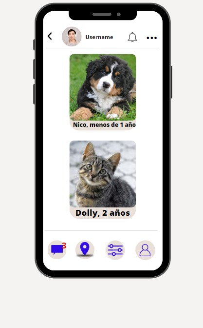
- ID: 2.
- 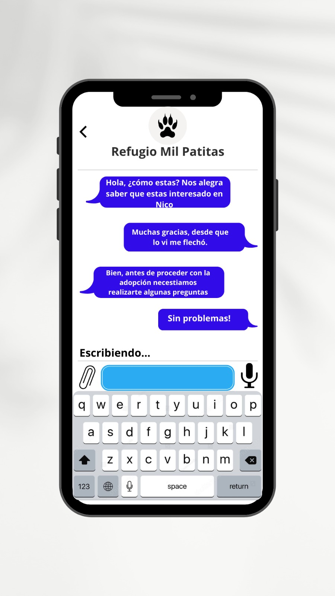
- ID: 3.
- 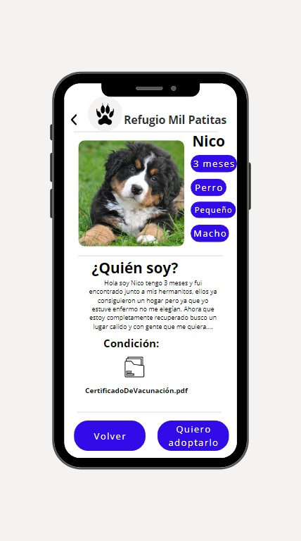
- ID: 4.
- 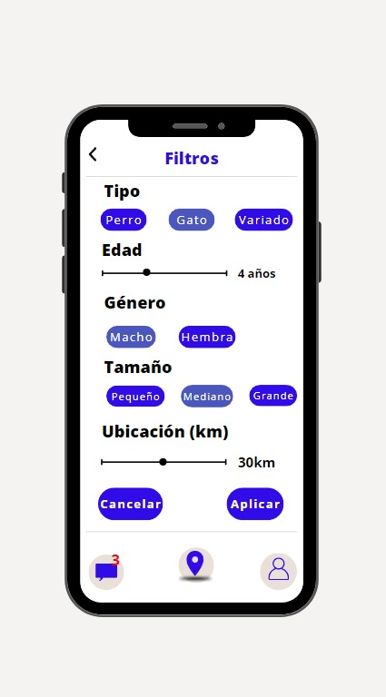
- ID: 5.
- 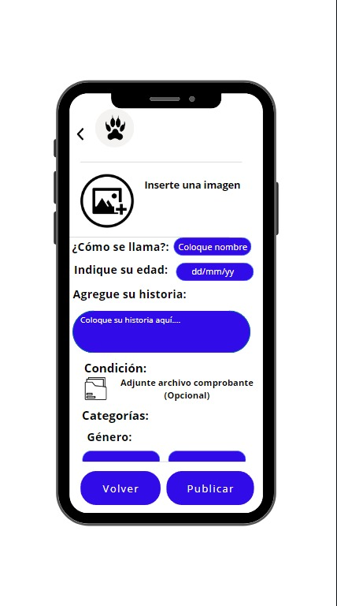
- ID: 6.
- 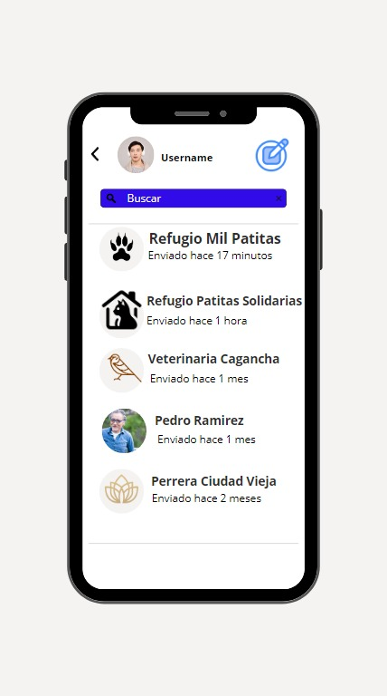

## Validación y verificación
### Verificación
- ¿Estamos construyendo el proyecto correctamente?
Para dar respuesta a esto validamos las herramientas utilizadas durante el proyecto, podemos afirmar que si estamos encaminado en una construcción correcta del proyecto ya que cumplimos con los estándares solicitados, en caso de un cambio como lo fue el cambiar nuestro enfoque de quienes son los usuarios lo documentamos. 

- ¿Involucramos a todas las partes interesadas (las más relevantes) tomando en cuenta sus opiniones?
En cuanto a esto tomamos opiniones dadas por las encuestas en los apartados donde pudieron brindar sus ideas y opiniones brindadas por personas no participantes del proyecto al mostrarles nuestras GUI.

### Validación
- Para poder saber si nuestro proyecto está en un camino necesitamos Validar
**¿Estamos construyendo el producto correcto?**
- Si, ya que cubrimos las áreas principales de las etapas de la adopción, como las son búsqueda, más detalle de la adopción, contacto con el de la publicación, entre otros. Estos valores fueron ideas iniciales nuestras y reafirmadas por la encuesta y entrevista realizada (ya que obtuvimos respuestas positivas de la misma implementación).

**¿Quiénes son los principales interesados o beneficiarios del proyecto?**
- Muchos se ven beneficiados, desde las perreras , veterinarias y refugios hasta incluso los ciudadanos de la zona ya que por un lado a las organizaciones mencionadas anteriormente, les es un gran costo mantener a los animales en adopción en buen estado y a su vez no siempre están promocionados como deberían; y por el lado de la gente, puede encontrar de una manera más fácil y segura un fiel compañero como son las mascotas. Esto generó que tengamos que cambiar nuestra perspectiva inicial y considerar a los usuarios en dos grupos, adoptantes y quienes dan en adopción para abordar sus necesidades. (Anteriormente solo teníamos en cuenta a los Adoptantes).

- En conclusión, una vez corregido lo mencionado anteriormente, finalizamos cumpliendo con todos los requisitos previos para que se puedan lograr los objetivos del negocio de manera efectiva.

## Reflexión
### Trabajo individual
#### Participación:
**Repositorio**
- Definición de Repositorio Git (Rodrigo).
- Definición de Repositorio Local y Remoto (Rodrigo).
**Aplicación de Git:** (Lucas).
- Versionado (Mateo).
**Elicitación:** 
- Creación de encuesta (Lucas, Mateo y Rodrigo).
- Creación de preguntas para entrevista (Mateo y Rodrigo).
- Realización y transcripción de entrevista (Mateo).
- Análisis de encuesta (Rodrigo).
- Puesta en común/Tormenta de ideas (Lucas,Mateo y Rodrigo).
- Creación de StakeHolders(Lucas,Mateo y Rodrigo).
- Creación de Análisis de Grupos de Interés(Lucas,Mateo y Rodrigo).
- Desarrollo de User Persona(Rodrigo).
- Implementación de Usuarios Potenciales (Lucas, Mateo y Rodrigo).
**Especificación**
- Desarrollo de Requerimientos Funcionales (Rodrigo).
- Desarrollo de Requerimientos No Funcionales (Rodrigo).
- Desarrollo de Use Cases(Lucas).
- Desarrollo de User Story(Mateo).
- Desarrollo de Bocetos de IU (Lucas).
**Validación y Verificación:**
- Desarrollo de Validación(Mateo).
- Desarrollo de Verificación(Lucas).
**Reflexión** (Lucas, Mateo y Rodrigo).
### Técnicas aplicadas y aprendizajes
- Durante el transcurso del curso Fundamentos de Ingeniería de Software aprendimos diferentes técnicas que nos permitieron realizar el proyecto sin inconvenientes. Nos basamos en la creación de una idea ya plasmada en la letra del Obligatorio, crear una aplicación para adoptar mascotas, dándonos una base del mismo mediante las técnicas de Elicitación y creando la estructura utilizando las técnicas de Especificación.
- Nuestra forma de trabajar pese a que cada uno se distribuía, fue más grupal, dando una puesta en común sobre cada tema, mejorando o arreglando incoherencias frente a texto presentado para poder subirlo con pocos errores, arreglando los que se visualizaran una vez agregados. 
- En parte gracias a esto pudimos solucionar problemas que si no hubiéramos corregido durante este período nos podría haber dificultado la continuación de este mismo proyecto (Nos referimos a el enfoque de quienes son nuestros usuarios principales).
- De esta manera, pese a que cada uno trabajó de forma individual sobre sus propios temas, con un enfoque grupal pudimos completar el proyecto sin inconvenientes.
