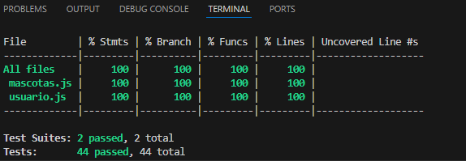

# Informe académico (entrega 2)

## Construcción
### Implementación de funciones principales
Dentro del proyecto logramos implementar las funciones solicitadas posterior el cierre de la primera parte del proyecto en su totalidad, con ciertas modificaciones en la solicitud especificada para mejorar la comodidad del usuario.
### Librerías externas
- En nuestro proyecto utilizamos tres libererías externas:
- - **Bootsrap**:Cuya version es: 5.2.3
- - **Jest** Cuya version es: 10.7.0
- - **Eslint** Cuya versión es: 9.3.0

## Interfaz de usuario
### Buenas prácticas
Mientras realizamos la construcción de nuestro proyecto hemos puesto en práctica el uso de Wave (Extensión que se puede utilizar en Chrome) y el uso de Markup Validation Service que proprociona W3C para verificar si hay inconsistencias en el Front-end de nuestro proyecto, permitiendonos no solo saber si hay repeticiones en nuestro codigo o si falta algun cierre de etiquetas por el uso de divs por ejemplo.
### Usabilidad
Tratamos de en su mayoria ser capaces de brindar una mayor simpleza al utilizar la web, que sea entendible y facil de utilizar. Nuestro objetivo era que el tiempo de aprendizaje sea corto y utilizamos un diseño simple para lograrlo.
### Accesibilidad
Respecto a la accesibilidad tratamos de cumplir con lo solicitado, utilizando alternativas de texto para las imagenes correspondientes de las mascotas agregadas, los colores seleccionados permiten a personas daltonicas utilizar la web sin problemas. Además para poder guiarnos en un camino correcto durante la construcción dimos uso de las ante mencionada herramienta Wave para diseñar la web sin inconvenientes permitiendo legiiblidad y cubrir todos los estandares solicitados(Como los textos alternativos en las imagenes).
## Codificación
### Configuración de entorno de desarrollo
Para poder llevar nuestro proyecto comodamente sin inconvenientes utilizamos las siguientes herramientas:
- **Visual Studio Code:** Utilizamos el entorno de desarrollo VSC ya que es una herramienta que permite la integración de terminal GitBash y diversas extensiones para trabajar comodamente como lo son el **Live Preview**.
- **Jest:** Para realizar la cobertura de todos los codigos utilizados y que no haya errores puntuales sobre datos agregados por ejemplo.
- **Eslint:** Para detectar errires de sintaxis en el código.
- **NodeJS:** Permitir la instalación de NPM (Node Package Manager) - Version 20.15.0

### Estándares de codificación
Los estanderes de codificación que utilizamos fueron: 
- **Identación:** El código HTML esta separado por nivel y permite una clara visualización de cuando inicia y termina una sección del HTML.
Nombres de Clases e IDs: Los nombres de las clases y las IDs son descriptivos y se da a entender.
- **Validacion HTML:** Validamos la estructura del HTML con el uso de W3C https://validator.w3.org/ para verificar si cumplen con los estanderes solicitados por la misma .
- **Funciones:** Utilizamos nombres de funciones entendibles sobre el funcionamiento de la misma función sin utilizar guiones a la hora de nombrarlas.
- **Sintaxis:** Se utiliza en su mayor parte una ampilia cobertura de las sintaxis, si bien no utilizamos comentarios para explicar el funcionamiento del código con las palabras nemotecnicas utilizadas podremos guiarnos en cuanto a su función.
### Buenas prácticas de OOP
Como una buena practica de OOP realizamos la separación de la lógica de la interfaz a excepción de un script utilizado para poder ocultar las otras partes del HTML que el usuario no desea ver.
### Análisis estático de código
Utilizamos npm run lint para poder visualizar si hay problemas, posibles errores o vulnerabilidades de seguridad. Este fue el resultado: 

## Test unitario
### Buenas prácticas
La implementación de los test unitarios fue lo mas importante a la hora de proceder con el desarrollo del codigo en si, este nos permitió visualizar y obtener los resultados con los test utilizados y verificar si la información llegaba de forma correcta al códigos. Al final de la creación de nuestra web logramos implementar el 100% de cobertura en los test unitarios.
### Informe de cobertura

## Reflexión
### Trabajo individual
- Lucas Acosta y Lara: mayor participación en Back-End:
- - Test unitarios.
- - Aplicación de Lint e informar errores a solucionar.

- Mateo Cabrera: mayor participación en Front-End: 
- - Creación y modificación en su totalidad de Html, Bootsrap y CSS 
- - Validación con Wave, W3C y corrección de errores

- Rodrigo con mayor participación en Back-End: 
- - Creación y desarrollo de Clases JS y funciones del Main.js.
- - Solución de errores informadas por Lucas.
- - Modificación parcial de Html
### Técnicas aplicadas y aprendizajes
Durante el desarrollo del proyecto aplicamos las técnicas aprendidas en la primera parte dividiendo de forma equitativa las tareas acorde a las fortalezas de cada uno en la que cada día que se modificaba algo o se agregaba alguna funcionalidad se daba aviso para que los demás pudieran tenerlo en cuenta en la construcción de sus respectivas partes. Yendo a la actualidad, con esta segunda parte logramos aprender a encontrar, solucionar y documentar errores tanto en nuestro propio proyecto como en proyectos ajenos del cual no tengamos un conocimiento total del código o casi nulo. Con ciertos objetivos impartidos por los docentes para tener una noción de lo que utilizamos o vamos a utilizar. El uso de ciertas herramientas para lograr reducir el margen de errores como lo son Wave y comandos internos como npm run test para probar los test unitarios y dar una cobertura total del código nos dio pie a realizar en mayor parte un sitio web bien establecido y con una estructura prolija.