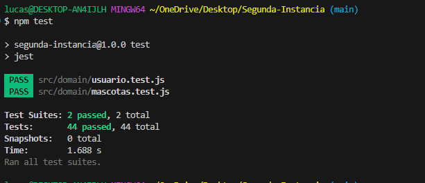

## Informe

## Issues Solucionados:
"No se verifica la casilla "Telefono"."
Solucion: (habia un error de formato en el input, se cambio a type number)
Se cumple el resultado esperado segun testers ("el resultado esperado es que al darle al boton "Registar" no registre el usuario y salte una alerta de que el numero de telefono que ingreso es incorrecto.")

"Casilla edad no verifica que numero se ingresa"
Solucion:(se agrega max y min al input)
Se cumple el resultado esperado segun testers ("el resultado esperado es que al ingresar una edad por encima de los 30 años, y presionar el boton agregar salte una alerta que diga que el perro es demasiado viejo (segun estudios los perros viven 20 años).")

"Agregar mascota sin verficacion" 
Solucion(se limito los caracteres usables a letras y numeros)
Se cumple el resultado esperado segun testers ("el resultado esperado es que al ingresar un simbolo o un caracter no deseado, en un campo de texto donde no corresponde, no te deje agregar la mascota y salte una alerta en el campo de texto.")

"Agregar mascota sin alert." 
Solucion: (se agrega un alert para cuando se ingresa una nueva mascota, que se dispara solo cuando todos los campos estan completos)
Se cumple el resultado esperado segun testers("el resultado esperado es que al ingresar todos los datos, y presionar el boton agregar salte una alerta para saber si se agrego correctamente la mascota")

## Test funciona correctamente

Solucion: Se tuvo que instalar y configurar dependencias de npm para que el testing funcione correctamente, se instalo babel para poder testear. Todos los tests solucionados, probado desde varios equipos.