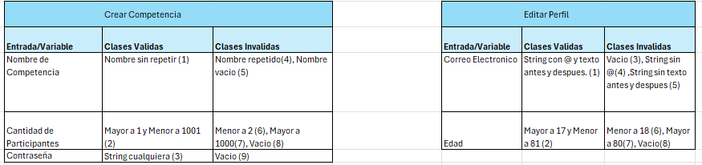
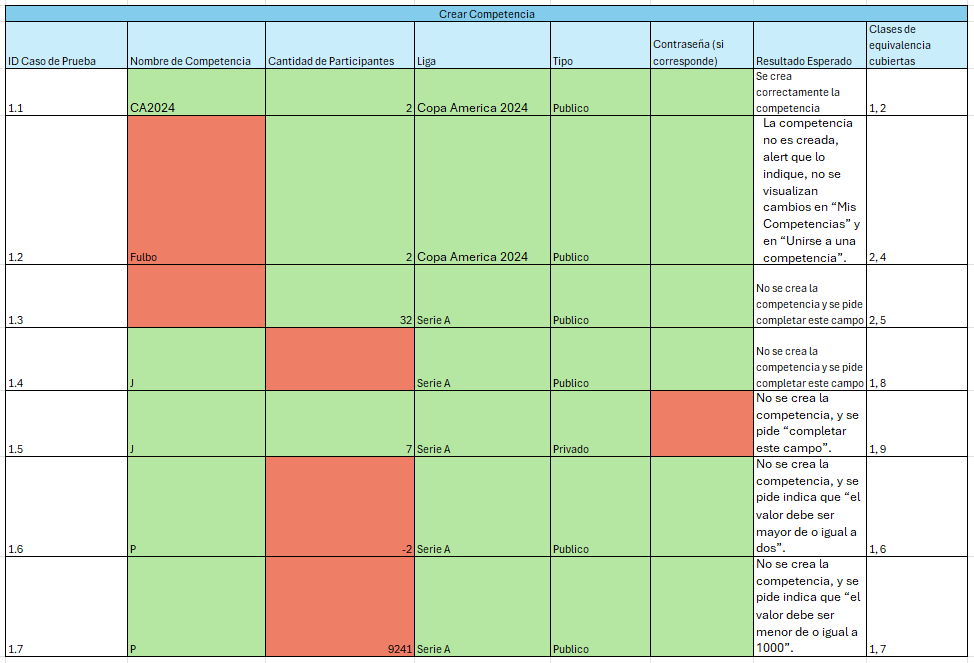
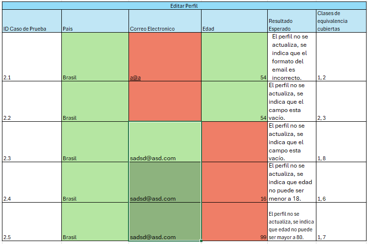
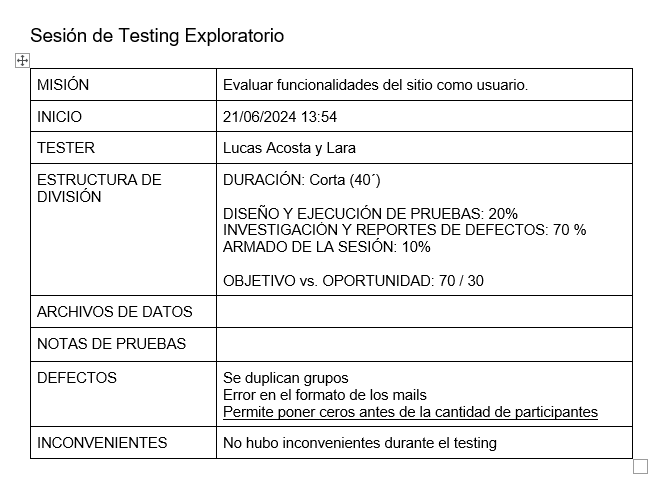
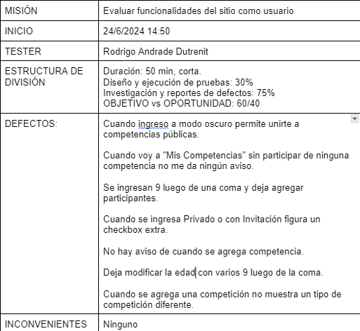

# Informe de testing 
Proyecto asignado: [[link](https://github.com/IngSoft-FIS-2024-1/proyecto-m3aan-arbulo-taran.git)]
## Test de sistema
### Diseño de casos de prueba

### Ejecución de casos de prueba

•   ID: 1.1
•   TÍTULO: Crear una nueva competición publica.
•   DESCRIPCIÓN: Verificar que la competición se crea correctamente al ingresar los datos de forma correcta.
•   PRECONDICIONES: El sistema está cargado y no existen competiciones con el mismo nombre.
•   PASOS A SEGUIR:
1.  Ingresar a crear una competencia.
2.  Hacer clic en checkbox "Publico".
3.  Ingresar nombre de la competición, liga y cantidad de participantes (entre 2 y 1000).
4.  Hacer clic en "Crear Competencia".
•   RESULTADOS ESPERADOS: La competencia es creada, vuelta a la pagina de inicio, se muestra la competencia en “Mis Competencias” y en “Unirse a una competencia”.
•   DATOS DE PRUEBA: Nombre: “CA2024”, Liga: “Copa America 2024”, Cantidad de Participantes: 2, Publico.
•   FECHA: 24/06/2024
•   TESTER: Lucas Acosta y Lara
•   RESULTADO OBTENIDO: Se creó la competencia y se mostro en las pestañas que correspondía.
•   ESTADO: Aprobado.

•   ID: 1.2
•   TÍTULO: Crear una nueva competición con un nombre ya existente.
•   DESCRIPCIÓN: Verificar que la competición no se cree si el nombre ya existe.
•   PRECONDICIONES: El sistema está cargado y existe una competencia con el mismo nombre.
•   PASOS A SEGUIR:
1.  Ingresar a crear una competencia.
2.  Hacer clic en checkbox "Publico".
3.  Ingresar liga y cantidad de participantes (entre 2 y 1000).
4.  Ingresar como nombre “Fulbo”
5.  Hacer clic en "Crear Competencia".
•   RESULTADOS ESPERADOS: La competencia no es creada, alert que lo indique, no se visualizan cambios en “Mis Competencias” y en “Unirse a una competencia”.
•   DATOS DE PRUEBA: Nombre: “Fulbo”, Liga: “Copa America 2024”, Cantidad de Participantes: 2, Publico.
•   FECHA: 24/06/2024
•   TESTER: Lucas Acosta y Lara
•   RESULTADO OBTENIDO: No se creó la competencia, pero se duplico en “Mis Competiciones” (o se mostro una sola vez si el usuario no formaba parte de “Fulbo”).
•   ESTADO: Rechazado.
•   IDs ISSUE: ID 1.

•   ID: 1.3
•   TÍTULO: No ingresar un nombre de competencia.
•   DESCRIPCIÓN: Verificar que no se cree la competencia al no ingresarle un nombre.
•   PRECONDICIONES: El sistema está cargado.
•   PASOS A SEGUIR:
1.  Ingresar a crear una competencia.
2.  Ingresar datos validos para numero de participantes, liga y tipo de competencia.
3.  No ingresar datos para nombre.
RESULTADOS ESPERADOS: No se crea la competencia y se indica que tiene que tener nombre.
•   DATOS DE PRUEBA: Nombre: “”, Número de participantes: 32, Liga:” Serie A”, Publico.
•   FECHA: 24/06/2024
•   TESTER: Lucas Acosta y Lara
•   RESULTADO OBTENIDO: No se crea la competencia, y se pide “completar este campo”.
•   ESTADO: Aprobado.

•   ID: 1.4
•   TÍTULO: No ingresar una cantidad de participantes.
•   DESCRIPCIÓN: Verificar que no se cree la competencia al no ingresarle un número de participantes.
•   PRECONDICIONES: El sistema está cargado.
•   PASOS A SEGUIR:
1.  Ingresar a crear una competencia.
2.  Ingresar datos validos para nombre, liga y tipo de competencia.
3.  No ingresar datos para numero de participantes.
RESULTADOS ESPERADOS: No se crea la competencia y se indica que tiene que tener numero de participantes.
•   DATOS DE PRUEBA: Nombre: “J”, Número de participantes:, Liga:” Serie A”, Publico.
•   FECHA: 24/06/2024
•   TESTER: Lucas Acosta y Lara
•   RESULTADO OBTENIDO: No se crea la competencia, y se pide “completar este campo”.
•   ESTADO: Aprobado.

•   ID: 1.5
•   TÍTULO: No ingresar una contraseña.
•   DESCRIPCIÓN: Verificar que no se cree la competencia al no ingresarle una contraseña, siendo esta de tipo privado.
•   PRECONDICIONES: El sistema está cargado.
•   PASOS A SEGUIR:
1.  Ingresar a crear una competencia.
2.  Ingresar datos válidos para nombre, liga y tipo de competencia.
3.  Hacer click en checkbox “Privado”.
4.  No ingresar contraseña
RESULTADOS ESPERADOS: No se crea la competencia y se indica que tiene que tener contraseña.
•   DATOS DE PRUEBA: Nombre: “J”, Número de participantes:7, Liga:” Serie A”, Privado, Contraseña:“”.
•   FECHA: 24/06/2024
•   TESTER: Lucas Acosta y Lara
•   RESULTADO OBTENIDO: No se crea la competencia, y se pide “completar este campo”.
•   ESTADO: Aprobado.

•   ID: 1.6
•   TÍTULO: Número de participantes=-2.
•   DESCRIPCIÓN: Verificar que no se cree la competencia al ser -2 la cantidad de participantes.
•   PRECONDICIONES: El sistema está cargado.
•   PASOS A SEGUIR:
1.  Ingresar a crear una competencia.
2.  Ingresar datos válidos para nombre, liga y tipo de competencia.
3.  Ingresar -2 para cantidad de participantes.
RESULTADOS ESPERADOS: No se crea la competencia y se indica que cantidad de participantes tiene que ser mayor a uno.
•   DATOS DE PRUEBA: Nombre: “P”, Número de participantes: -2, Liga:” Serie A”, Publico.
•   FECHA: 24/06/2024
•   TESTER: Lucas Acosta y Lara
•   RESULTADO OBTENIDO: No se crea la competencia, y se pide indica que “el valor debe ser mayor de o igual a dos”.
•   ESTADO: Aprobado.

•   ID: 1.7
•   TÍTULO: Número de participantes=9241.
•   DESCRIPCIÓN: Verificar que no se cree la competencia al ser 9241 la cantidad de participantes.
•   PRECONDICIONES: El sistema está cargado.
•   PASOS A SEGUIR:
1.  Ingresar a crear una competencia.
2.  Ingresar datos válidos para nombre, liga y tipo de competencia.
3.  Ingresar 9241 para cantidad de participantes.
RESULTADOS ESPERADOS: No se crea la competencia y se indica que cantidad de participantes tiene que ser menor a mil.
•   DATOS DE PRUEBA: Nombre: “P”, Número de participantes: 9241, Liga:” Serie A”, Publico.
•   FECHA: 24/06/2024
•   TESTER: Lucas Acosta y Lara
•   RESULTADO OBTENIDO: No se crea la competencia, y se pide indica que “el valor debe ser menor de o igual a 1000”.
•   ESTADO: Aprobado.

•   ID: 2.1
•   TÍTULO: Ingresar mal los datos del email
•   DESCRIPCIÓN: Verificar que no permita ingresar datos erróneos como un email.
•   PRECONDICIONES: El sistema está cargado.
•   PASOS A SEGUIR:
1.  Ingresar a ajustes.
2.  Ingresar a Perfil.
3.  Ingresar a Editar Perfil
4.  Ingresar pais y edad correctamente.
5.  Ingresar como email “a@a”
6.  Hacer clic en "Guardar".
•   RESULTADOS ESPERADOS: El perfil no se actualiza, se indica que el formato del email es incorrecto.
•   DATOS DE PRUEBA: Pais:”Brasil”, Correo Electrónico: “a@a”, Edad: 54.
•   FECHA: 24/06/2024
•   TESTER: Lucas Acosta y Lara
•   RESULTADO OBTENIDO: Se guardo el perfil con el correo electrónico mal.
•   ESTADO: Rechazado.
•   IDs ISSUE: ID 2.

•   ID: 2.2
•   TÍTULO: No ingresar email.
•   DESCRIPCIÓN: Verificar que no permita actualizar los datos sin ingresar email.
•   PRECONDICIONES: El sistema está cargado.
•   PASOS A SEGUIR:
1.  Ingresar a ajustes.
2.  Ingresar a Perfil.
3.  Ingresar a Editar Perfil
4.  Ingresar pais y edad correctamente.
5.  Ingresar como email “”
6.  Hacer clic en "Guardar".
•   RESULTADOS ESPERADOS: El perfil no se actualiza, se indica que el campo esta vacío.
•   DATOS DE PRUEBA: Pais:”Brasil”, Correo Electrónico: “”, Edad: 54.
•   FECHA: 24/06/2024
•   TESTER: Lucas Acosta y Lara
•   RESULTADO OBTENIDO: No se guardo el perfil y se indica completar el campo.
•   ESTADO: Aprobado.

•   ID: 2.3
•   TÍTULO: No ingresar edad.
•   DESCRIPCIÓN: Verificar que no permita actualizar los datos sin ingresar edad.
•   PRECONDICIONES: El sistema está cargado.
•   PASOS A SEGUIR:
1.  Ingresar a ajustes.
2.  Ingresar a Perfil.
3.  Ingresar a Editar Perfil
4.  Ingresar email y pais correctamente.
5.  Ingresar como edad “”
6.  Hacer clic en "Guardar".
•   RESULTADOS ESPERADOS: El perfil no se actualiza, se indica que el campo esta vacío.
•   DATOS DE PRUEBA: Pais:”Brasil”, Correo Electrónico: “sadsd@asd.com”, Edad:””.
•   FECHA: 24/06/2024
•   TESTER: Lucas Acosta y Lara
•   RESULTADO OBTENIDO: No se guardo el perfil y se indica completar el campo.
•   ESTADO: Aprobado.

•   ID: 2.4
•   TÍTULO: Edad menor a 18.
•   DESCRIPCIÓN: Verificar que no permita actualizar los datos siendo edad menor a 18.
•   PRECONDICIONES: El sistema está cargado.
•   PASOS A SEGUIR:
1.  Ingresar a ajustes.
2.  Ingresar a Perfil.
3.  Ingresar a Editar Perfil
4.  Ingresar email y pais correctamente.
5.  Ingresar como edad “16”
6.  Hacer clic en "Guardar".
•   RESULTADOS ESPERADOS: El perfil no se actualiza, se indica que edad no puede ser menor a 18.
•   DATOS DE PRUEBA: Pais:”Brasil”, Correo Electrónico: “sadsd@asd.com”, Edad:”16”.
•   FECHA: 24/06/2024
•   TESTER: Lucas Acosta y Lara
•   RESULTADO OBTENIDO: No se guardo el perfil y se indica que el valor debe ser mayor o igual a 18.
•   ESTADO: Aprobado.

•   ID: 2.5
•   TÍTULO: Edad mayor a 80.
•   DESCRIPCIÓN: Verificar que no permita actualizar los datos siendo edad menor a 18.
•   PRECONDICIONES: El sistema está cargado.
•   PASOS A SEGUIR:
1.  Ingresar a ajustes.
2.  Ingresar a Perfil.
3.  Ingresar a Editar Perfil
4.  Ingresar email y pais correctamente.
5.  Ingresar como edad “99”
6.  Hacer clic en "Guardar".
•   RESULTADOS ESPERADOS: El perfil no se actualiza, se indica que edad no puede ser mayor a 80.
•   DATOS DE PRUEBA: Pais:”Brasil”, Correo Electrónico: “sadsd@asd.com”, Edad:”99”.
•   FECHA: 24/06/2024
•   TESTER: Lucas Acosta y Lara
•   RESULTADO OBTENIDO: No se guardo el perfil y se indica que el valor debe ser menor o igual a 80.
•   ESTADO: Aprobado.

### Sesiones de pruebas exploratorias

## Reporte de issues
### Buenas prácticas
A la hora de reportar los issues del proyecto asignado asignamos una ID del reporte diferente del ID que asigna Git al realizar el issue a su vez marcamos con los labels correspondientes lo que son errores o bugs.
### Clasificación
Los issues realizados son asignados un nivel de severidad y prioridad según corresponda, al marcar la severidad y prioridad nos basamos en esatas clasificaciones:
- **Prioridad**
- - **Alta:** Problemas que deben ser corregidos inmediatamente ya que afecta la experiencia del usuario
- - **Media:** Problema que debe ser corregido temprano pero no inmediatamente.
- - **Bajo:** Problema que puede o no ser resuelto ya que no afecta en casi nada la experiencia del usuario.
- **Severidad**
- - **Alta:** Son errores que afectan o pueden afectar de gran forma la funcionalidad del sistema impidiendo utilizar funciones del sistema o que se realice algo diferente a lo que el usuario solicitó.
- - **Media:** Son errores que afectan o pueden afectar la funcionalidad del sistema pero no impide al usuario utilizarla, sin embargo estas pueden derivar en un problema mayor si no se trata a tiempo.
- - **Baja:** Son errores que no afectan o apenas lo hacen en alguna funcionalidad del sistema y no impide que el usuario pueda operar tranquilamente.
## Informe de calidad del sistema
### Resumen de issues
La mayoria de issues realizados indican que no tienen problemas urgentes a resolver a excepción del issue report ID 10 :" Cuando se agrega una competición muestra un tipo de competición diferente" que al intentar agregar un tipo de competencia sin ser "Campeonato Uruguayo 2024", "Copa America 2024" y "Copa CONMEBOL Libertadores" carga en datos "Campeonato Uruguayo 2024" lo cual es crítico ya que si se desea cargar otra competencia diferente la misma no estaría funcionando.
### Evaluación global de calidad
A excepción del inconveniente mencionado anteriormente logramos visualizar que la página tiene una buena estructura y cobertura de incidentes para su normal operación aunque permita algunas entradas de datos invalidas y se duplique la solicitud si se repite el nombre de la competición (Aunque solo visual en mis competiciones y no funcional al intentar inscribirme ya que por ahi no hace aparición).
## Reflexión
### Trabajo individual
- **Lucas Acosta y Lara:** 
- - Diseño e implementación de Casos de Prueba
- - Desarrollo de Issues
- - Creación de Sesiones de Pruebas Exploratorias
- **Rodrigo Andrade:**
- - Redacción de Informe de testing.
- - Desarrollo de Issues
- - Creación de Sesiones de Pruebas Exploratorias
### Técnicas aplicadas y aprendizajes
En la fase final del proyecto nos dedicamos a realizar pruebas de testing de **Caja Negra** del cual aprendimos a realizar una mayor cobertura sobre un sistema sin conocimiento del código, diferentes métodos para validar el funcionamiento del mismo y poder realizar la mayor cobertura de errores posibles. Aprendimos a documentarlo y a entender el funcionamiento y necesidad de realizar testing en el proyecto de forma temprana y final del mismo. Como se mencionó anteriormente estas pruebas realizadas son sobre otro proyecto ajeno al nuestro, por lo cual nos permitió explorar sin estar límitados al conocer el funcionamiento interno del proyecto (nos referimos al código mismo) por lo cual nos permite ser mas objetivos a la hora de explorar la web.

